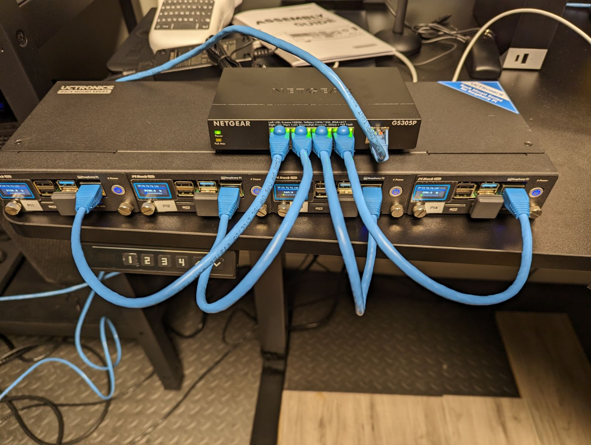

# Install and Configure Software to run UCTRONICS OLED Displays SKU_RM0004 on Raspberry Pi

Ansible playbook to install and configure the manufacturer software that runs the OLED displays on the UCTRONICS Pi Rack Pro.



Run the script, change <piusername> to the pi root or admin user
```
ansible-playbook playbook.yml -u <piusername> -k
```

Manufaturer repo for the software: https://github.com/UCTRONICS/SKU_RM0004

Issue, comments and suggestions used to inform this script: https://github.com/UCTRONICS/SKU_RM0004/issues/2

### Notes

The script includes a reboot. If the Pi has a dynamic IP, there is a chance it won't complete the script if the Pi IP address changes on reboot. Assigning static IP addresses in advance might help.

Pre and post bookwork release has a variation in boot file path. Change `boot_config_path` variable in `playbook.yml` to match the path on your Pi. See: http://rptl.io/configtxt
